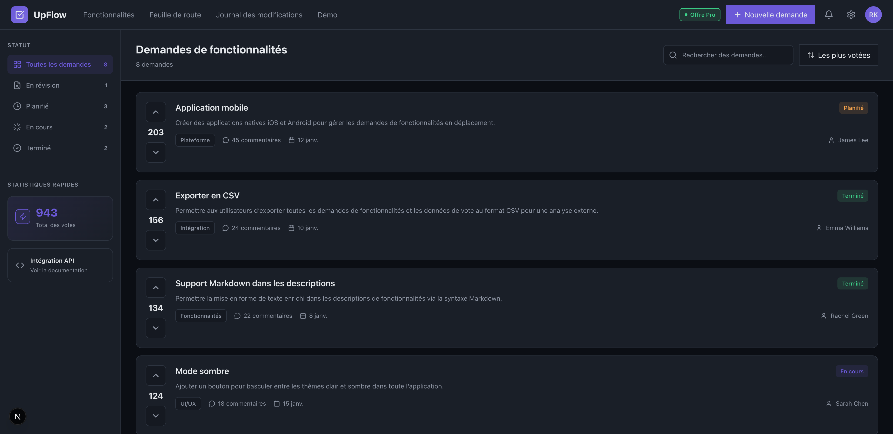

# UpFlow (demo) — dashboard + widget embarquable



Ce repo contient :
- un **dashboard** (interne) de gestion de demandes de fonctionnalités
- un **widget** (public) de vote + soumission
- un **script d’intégration** pour l’embarquer sur n’importe quel site via une balise `<script>` (iframe)

## Démarrer

```bash
npm install
npm run dev
```

Pages utiles :
- Dashboard : `http://localhost:3000/`
- Démo widget : `http://localhost:3000/demo`
- Page embed (dans un iframe) : `http://localhost:3000/embed`

Voir `DEMO.md` pour le détail.

## Intégrer le widget sur un site

1) Déploie cette app (ex: `https://YOUR_UPFLOW_DOMAIN`)

2) Ajoute ça sur ton site :

```html
<script src="https://YOUR_UPFLOW_DOMAIN/upflow-widget.js"></script>
<script>
  UpFlow.init({
    projectId: "your-project-id",
    // projectKey: "your-public-project-key",
    position: "bottom-right", // ou "bottom-left"
    theme: "dark", // ou "light"
    // accent: "#6b59d7",
  });
</script>
```

Notes :
- Le widget est injecté via **iframe** (donc isolé du CSS du site hôte).
- Si tu ajoutes des headers de sécurité, il faut **autoriser l’iframe** (`/embed`) et le script (`/upflow-widget.js`).
- Les données sont stockées dans MongoDB via l’API Next (votes persistants). Ajoute anti-spam + auth si tu veux durcir.
- Si `allowedOrigins` contient ton domaine, tu peux **omettre** `projectKey` dans le snippet.
- En Next.js App Router, le snippet doit être chargé dans un **Client Component** (sinon `onLoad` est refusé).

## API + MongoDB + Auth

1) Configure MongoDB :

```bash
cp .env.example .env.local
```

2) Renseigne `MONGODB_URI` et `UPFLOW_AUTH_SECRET` (ex: une clé aléatoire longue).
   Ajoute aussi la config SMTP (`SMTP_HOST`, `SMTP_PORT`, `SMTP_USER`, `SMTP_PASS`, `SMTP_FROM`, `SMTP_SECURE`) pour l'envoi des emails de reset.

3) Va sur `http://localhost:3000/signup` pour créer ton compte admin, puis connecte‑toi.

4) Ouvre le dashboard et crée un projet via **Paramètres** → **Projets & domaines**.
   Ajoute tes `allowedOrigins` (ex: `http://localhost:3000`).

Endpoints utiles :
- `GET /api/features?projectId=...&voterId=...`
- `POST /api/features`
- `POST /api/features/:id/vote`

Le widget utilise `projectId` + (`projectKey` ou `allowedOrigins`) pour isoler les données par site/produit.
Le dashboard admin stocke le `projectId` sélectionné en localStorage (tu peux aussi passer `/?projectId=...&projectKey=...` pour tester).

### Snippet (Next.js + TypeScript)

```tsx
// app/components/UpflowScript.tsx
"use client";

import { useEffect } from "react";

export default function UpflowScript() {
  useEffect(() => {
    const script = document.createElement("script");
    script.src = "https://YOUR_UPFLOW_DOMAIN/upflow-widget.js";
    script.onload = () => {
      window.UpFlow?.init({ projectId: "demo" });
    };
    document.body.appendChild(script);
  }, []);

  return null;
}
```

Puis dans `app/layout.tsx` :

```tsx
import UpflowScript from "./components/UpflowScript";

<body>
  {children}
  <UpflowScript />
</body>
```
